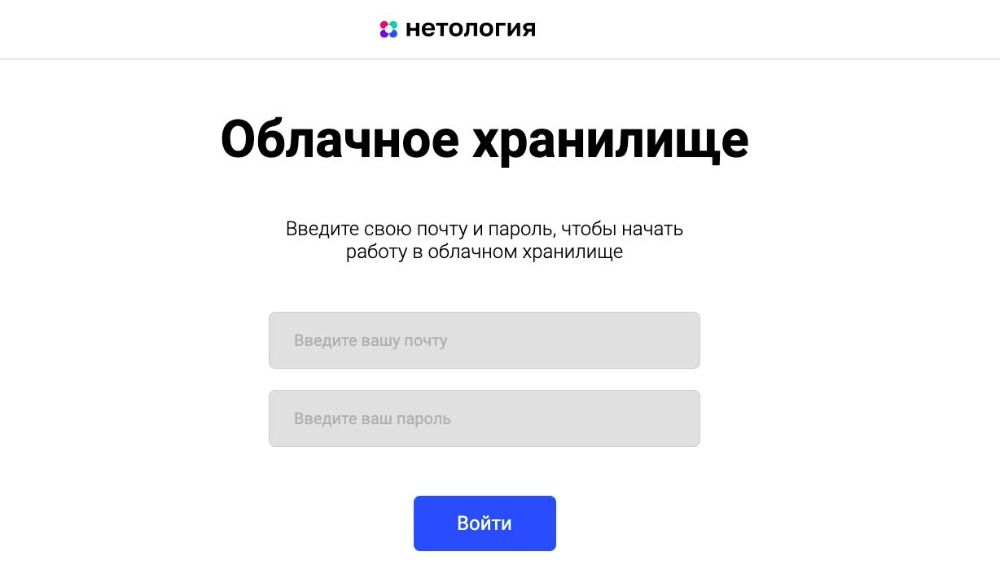
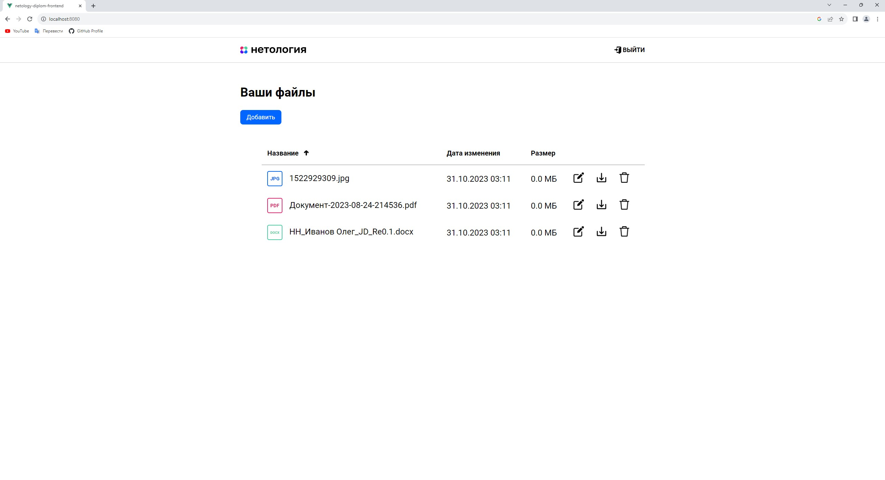

# Дипломная работа «Облачное хранилище»
## Описание работы
Задача — разработать REST-сервис. Сервис должен предоставить REST-интерфейс для хранения, загрузки , удаления, скачивания и вывода списка уже загруженных файлов пользователя.

* Все запросы к сервису должны быть авторизованы.
* Заранее подготовленное веб-приложение (FRONT) должно подключаться к разработанному сервису без доработок, а также использовать функционал FRONT для авторизации, загрузки и вывода списка файлов пользователя.


## Требования к приложению
1. Сервис должен предоставлять REST-интерфейс для интеграции с FRONT.
2. Сервис должен реализовывать все методы, описанные в [**yaml-файле**](https://github.com/netology-code/jd-homeworks/blob/master/diploma/CloudServiceSpecification.yaml):

- Авторизация.
- Добавление файла.
- Вывод списка файлов.
- Редактирование имени файла.
- Удаление файла.
- Загрузка файла.
 

## Реализация:
- Приложение (REST-сервис) разработано с использованием **Spring Boot**
- Реализована авторизация с помощью **JWT-Token Authentication,
Spring Security, CORS.
- База данных - **PostgreSQL**
- Сборщик пакетов - **maven**
- Для запуска используется **docker, docker-compose**
- Логирование  - **log4j** (Логируются операции - уровень INFO и ошибки -уровень ERROR).
Запись логов в файле **cloud.log**
- Протестирован с помощью **Postman**
Тесты:
 - Unit тесты с использованием **Mockito**
 - Интеграционные тесты с использованием **testcontainers**


## 1. Запуск BACKEND:

###  Для запуска REST-сервиса необходимо :

```
docker-compose up
```
Backend проект запустится на порту **8091**

При запуске приложения, в базе автоматически создадутся :

**Tаблицы**:
* users,
* files,
* roles,
* user_roles

и 
**Стартовые пользователи:**
```
login: oleg@gmail.com, password: oleg
login: User1@mail.ru, password: user

```


## Описание и запуск FRONT

1. Установите nodejs (версия не ниже 19.7.0) на компьютер, следуя инструкции https://nodejs.org/ru/download/current.
2. Скачайте FRONT https://github.com/netology-code/jd-homeworks/tree/master/diploma/netology-diplom-frontend (JavaScript).
3. Перейдите в папку FRONT приложения и все команды для запуска выполняйте из неё.
4. Следуя описанию README.md FRONT проекта, запустите nodejs-приложение (npm install, npm run serve).
5. Далее нужно задать url для вызова своего backend-сервиса.
    - В файле .env FRONT (находится в корне проекта) приложения нужно изменить url до backend, например: VUE_APP_BASE_URL=http://localhost:8080.
        1. Нужно указать корневой url вашего backend, к нему frontend будет добавлять все пути согласно спецификации
        2. Для VUE_APP_BASE_URL=http://localhost:8080 при выполнении логина frontend вызовет http://localhost:8080/login
    - Запустите FRONT снова: npm run serve.
    - Изменённый url сохранится для следующих запусков.
6. По умолчанию FRONT запускается на порту 8080 и доступен по url в браузере http://localhost:8080.
    - Если порт 8080 занят, FRONT займёт следующий доступный (8081). После выполнения npm run serve в терминале вы увидите, на каком порту он запустился.

## Авторизация приложения

FRONT-приложение использует header auth-token, в котором отправляет токен (ключ-строка) для идентификации пользователя на BACKEND. Для получения токена нужно пройти авторизацию на BACKEND и отправить на метод /login логин и пароль. В случае успешной проверки в ответ BACKEND должен вернуть json-объект с полем auth-token и значением токена. Все дальейшие запросы с FRONTEND, кроме метода /login, отправляются с этим header. Для выхода из приложения нужно вызвать метод BACKEND /logout, который удалит/деактивирует токен. Последующие запросы с этим токеном будут не авторизованы и вернут код 401.

## Взаимодействие приложений
FRONT приложение отправляет credentials в теле запроса на эндпоинт /login BACKEND приложения.
Запрос проходит через CORS filter, CSRF filter, перехватывается JwtTokenFilter и передается далее на аутентификацию.
В случае успешной аутентификации генерируется токен, которые возвращается на FRONT в ответе с заголовком `auth-token`
Все дальнешие запросы FRONT делает с этим токеном в заголовке `auth-token`.
При выходе из приложения вызывается метод BACKEND /logout, который удаляет токен из TokenStore и все дальнейшие запросы с этим токеном не действительны.
При удачном запуске нашего REST-сервиса и Front приложения, по адресу http://localhost:8080/ откроется вот такой интерфейс:



При успешной авторизации, пользователь попадает в личный кабинет, где ему будет доступны функции добавления, удаления, скачивания и редактирования файлов. 

